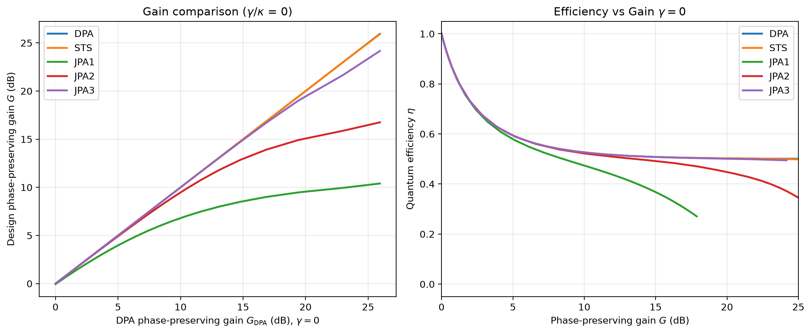

# STS-amplifier

This repository contains code to reproduce and explore the gain/efficiency plots associated with the paper:

- https://doi.org/10.48550/arXiv.2602.13563

## What this repository does

This project plots the **phase-preserving gain** and **(lossless) quantum efficiency** for:

- **Degenerate Parametric Amplifier (DPA)**
- **Josephson Parametric Amplifier (JPA)**
- **Kerr-free STS parametric amplifier**

Simulations are performed using **QuTiP** steady-state solutions and a two-probe method to extract the phase-preserving gain.

## Theory / model

Hamiltonians and supporting equations used by this code are given in:

- https://doi.org/10.48550/arXiv.2602.13563

This repository focuses on numerical evaluation and plotting; please refer to the paper for full derivations and physical discussion.

---

## Installation

### 1) Clone the repository

```bash
git clone https://github.com/kyanik/Kerr-free-STS-Amplifier.git
cd Kerr-free-STS-Amplifier
```

### 2) Create and activate a virtual environment

macOS/Linux:

```bash
python -m venv .venv
source .venv/bin/activate
```

Windows (PowerShell):

```bash
python -m venv .venv
.venv\Scripts\Activate.ps1
```

### 3) Install the package

```bash
pip install -e .
```

---

## Quickstart (Terminal / CLI)

Show available commands:

```bash
STS-amplifier -h
```

Show help for the gain/efficiency plot:

```bash
STS-amplifier gain-eta --help
```

Example run (replace parameters with values appropriate to your device/simulation):

```bash
STS-amplifier gain-eta \
  --Delta 0 \
  --kappa 1.884e9 \
  --gamma 0 \
  --drive 0.2 \
  --theta -1.57079632679 \
  --phi 0 \
  --n-levels 150 \
  --npts 30 \
  --STS-EC 3.016e7 \
  --STS-EL 1.036e13 \
  --JPA1-F 0.785398 --JPA1-EC 2.670e7 --JPA1-EJ 1.257e13 \
  --JPA2-F 0.785398 --JPA2-EC 5.341e6 --JPA2-EJ 1.194e13 \
  --JPA3-F 0.785398 --JPA3-EC 5.341e5 --JPA3-EJ 1.257e13
```

Notes:
- Large `--n-levels` and `--npts` can make runs slow, since each sweep point requires steady-state solves.
- Parameter conventions/units follow the paper.

---

## Quickstart (Jupyter notebook)

Start Jupyter from the same environment where you installed the package:

```bash
source .venv/bin/activate
pip install jupyter
jupyter lab
```

In a notebook cell:

```python
import numpy as np
from STS_amplifier.plotting import plot_gain_eta_from_physical_params

fig = plot_gain_eta_from_physical_params(
    Delta=0.0,
    kappa=3e8 * 2*np.pi,
    gamma=0.0,
    drive=0.2,
    n_levels=150,
    theta=-np.pi/2,
    phi=0.0,
    npts=30,
    STS_EC=48e5 * 2*np.pi,
    STS_EL=1650e9 * 2*np.pi,
    JPA1_F=np.pi/4, JPA1_EC=5*85e5 * 2*np.pi, JPA1_EJ=2000e9 * 2*np.pi,
    JPA2_F=np.pi/4, JPA2_EC=85e5 * 2*np.pi,  JPA2_EJ=1900e9 * 2*np.pi,
    JPA3_F=np.pi/4, JPA3_EC=85e4 * 2*np.pi,  JPA3_EJ=2000e9 * 2*np.pi,
)

fig
```

---

## Example output

The example plot is stored at:

- `docs/img/gain_eta_example.png`

and should look like below:



### Generate/update the example plot image

After creating `fig` in a notebook (or a Python session), run:

```python
import os
os.makedirs("docs/img", exist_ok=True)
fig.savefig("docs/img/gain_eta_example.png", dpi=200, bbox_inches="tight")
```

Commit the image:

```bash
git add docs/img/gain_eta_example.png README.md
git commit -m "Add README and example plot"
git push
```

---

## Citation

If you use this repository in academic work, please cite:

- https://doi.org/10.48550/arXiv.2602.13563